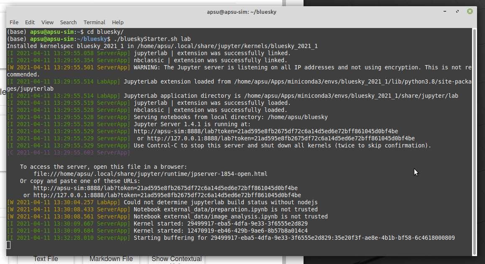
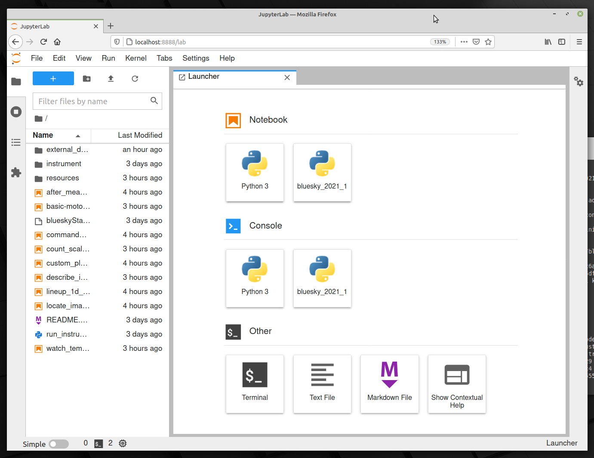

# epics-bluesky-vm

*APS Training for Bluesky Data Acquisition*.

**Objective**

Simulate a beam line using EPICS IOCs, GUIs, Bluesky and related components.

This repository contains the [instructions](./.create/README.md) and resources
to create a VirtualBox virtual machine image.

# About this VM


* OS: [Linux Mint 20.1](https://www.linuxmint.com/)
* EPICS
  * base: [7.0.5](https://epics.anl.gov/base/R7-0/5.php)
  * MEDM: [3.1.16](https://github.com/epics-extensions/medm)
  * caQtDM: [4.3.0+](https://github.com/caqtdm/caqtdm/)
  * synApps: [6.2](https://www.aps.anl.gov/BCDA/synApps)
  * AreaDetector: [3.10](https://github.com/areaDetector/areaDetector/releases)
* Python: [Miniconda 4.9.2](https://www.anaconda.com/)
* Bluesky: [2021-04-11](https://blueskyproject.io/)
* Jupyter: [3.0.11](http://jupyterlab.io/)

## Installation

Follow these [instructions](install_vm.md) to install *EPICS-Bluesky-Simulator*,
including *Oracle VM VirtualBox Manager*.

## Bluesky Training Notebooks

Jupyter notebooks provide specific training for use of the Bluesky Framework for data acquisition and analysis.

* [Bluesky *Hello, World!*](https://nbviewer.jupyter.org/github/BCDA-APS/bluesky_instrument_training/blob/main/hello_world.ipynb)
* [About the Instrument Simulation](https://nbviewer.jupyter.org/github/BCDA-APS/epics-bluesky-vm/blob/main/describe_instrument.ipynb)
* [Bluesky Command Review](https://nbviewer.jupyter.org/github/BCDA-APS/epics-bluesky-vm/blob/main/command_review.ipynb)
* [count with a scaler](https://nbviewer.jupyter.org/github/BCDA-APS/epics-bluesky-vm/blob/main/count_scaler.ipynb)
* [scan with motor and scaler](https://nbviewer.jupyter.org/github/BCDA-APS/epics-bluesky-vm/blob/main/basic-motor-scaler-scan.ipynb)
* [lineup on a 1-D peak](https://nbviewer.jupyter.org/github/BCDA-APS/epics-bluesky-vm/blob/main/lineup_1d_peak.ipynb)
* [temperature](https://nbviewer.jupyter.org/github/BCDA-APS/epics-bluesky-vm/blob/main/watch_temperature.ipynb)
* [write a custom measurement plan](https://nbviewer.jupyter.org/github/BCDA-APS/epics-bluesky-vm/blob/main/custom_plan.ipynb)

* [area detector](https://nbviewer.jupyter.org/github/BCDA-APS/epics-bluesky-vm/blob/main/locate_image_peak.ipynb)
* [analyze image data later](https://nbviewer.jupyter.org/github/BCDA-APS/epics-bluesky-vm/blob/main/after_measurement.ipynb)

* [analyze data extracted from another Bluesky](./external_data/README.md)

## Start Jupyter Lab

From the VM, open a terminal window.  One of these methods:

* press these keys at the same time: `<Ctrl>+<Alt>+T`
* click the *Terminal* icon in the lower command bar
* select the *LM* menu (in lower left corner), then *Terminal*

Use these commands in the terminal to start the Jupyter Lab notebook server:

```sh
cd ~/bluesky
./blueskyStarter.sh lab
```

The terminal console window will look similar to this view:



In a minute or less, a web browser should open with a view, such as:



## References

name | URL
--- | ---
Bluesky Framework | https://blueskyproject.io/
bluesky | https://blueskyproject.io/bluesky
ophyd | https://blueskyproject.io/ophyd
databroker | https://blueskyproject.io/databroker
apstools | https://apstools.readthedocs.io/
APS instruments | https://github.com/BCDA-APS/use_bluesky/wiki/
