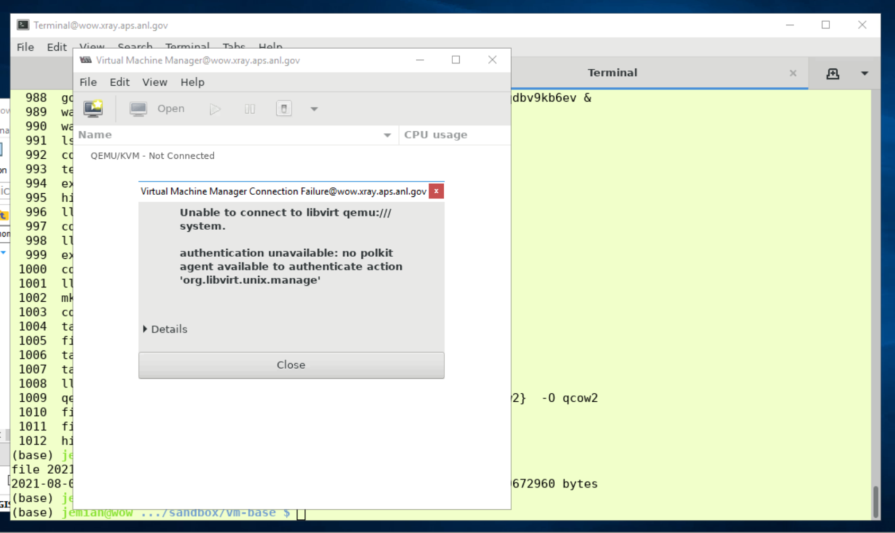
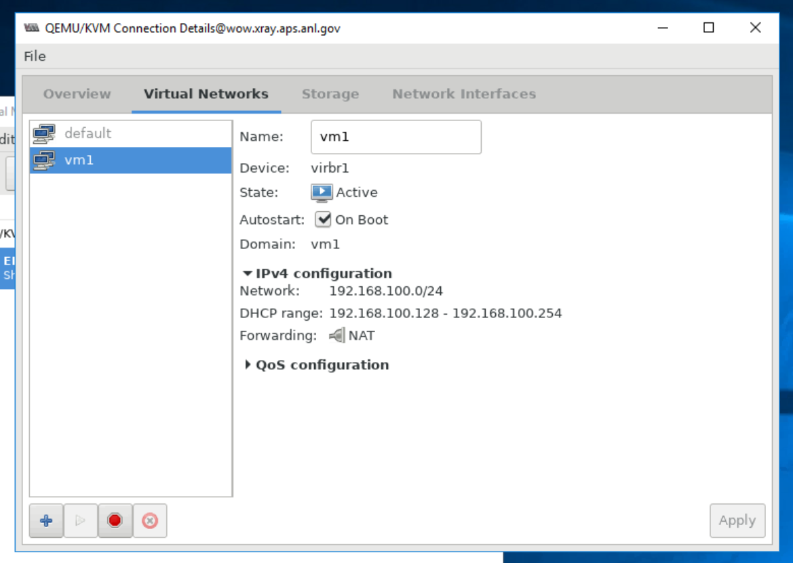
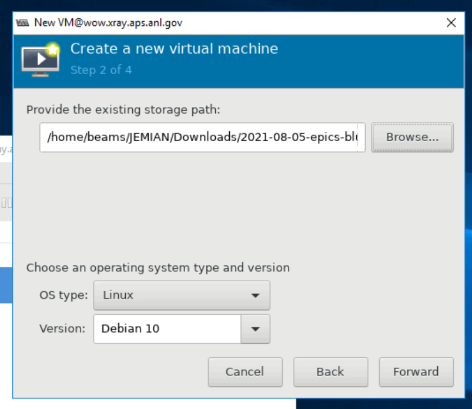
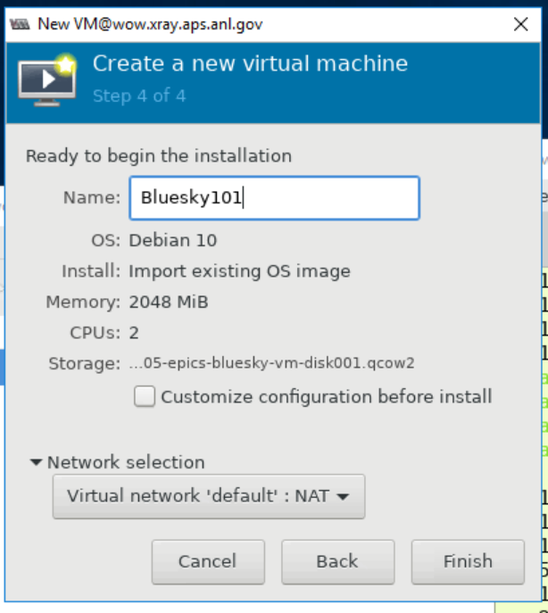

# Run VM on RHEL

*Running OVA on RHEL at the APS*

## Background details

For installation, proceed to the [Converting](#converting) section below.

You can run VirtualBox `.ova` (file virtual machine) VMs with the native
QEMU/KVM on RHEL.  The `.ova` must first be
[converted](https://blog.ricosharp.com/posts/2019/Converting-ova-file-to-qcow2)
([more complete article with additional
steps](https://access.redhat.com/discussions/4340061)).

Networking help to [create a network
bridge](https://computingforgeeks.com/how-to-create-and-configure-bridge-networking-for-kvm-in-linux/)
([alternative
instructions](https://wiki.hackzine.org/sysadmin/kvm-import-ova.html))

Special thanks to Troy Lutes, APS IT, for describing these steps.

## Converting

**NOTE**: You might be able to skip this step if you have access to
`/net/beams/JEMIAN/Downloads/2021-08-05-epics-bluesky-vm-disk001.qcow2`
on the APS network.

Assuming you have a `/local` directory (faster access than one of the network mounted drives in yout home directory) available with sufficient free
space, then copy the (28GB!) disk image from my directory to the directory you choose:

```sh
cp ~jemian/Downloads/2021-08-05-epics-bluesky-vm-disk001.qcow2 /local/
```

<details>
<summary>Conversion steps ONLY if you can't get the .qcow2 file</summary>

1. Expand the `.ova` file (it is an uncompressed `tar` archive file), then convert to *QEMU QCOW* format.

   ```sh
   tar xf ../2021-08-05-epics-bluesky-vm.ova 
   qemu-img convert 2021-08-05-epics-bluesky-vm-disk001.{vmdk,qcow2}  -O qcow2
   ```

2. Confirm the resulting file format is actually recognized:

   ```sh
   file 2021-08-05-epics-bluesky-vm-disk001.qcow2 
   2021-08-05-epics-bluesky-vm-disk001.qcow2: QEMU QCOW Image (v3), 42949672960 bytes
   ```

</details>

## IT Permissions

Request APS IT for permission to run KVM on your workstation & account.

<details>
<summary>Get permission from IT</summary>

When you do not yet have permission (to connect to `libvirt` and the
`qemu:/` system), you will see a screen that looks like this:



<details>
<summary>error message</summary>

```
Unable to connect to libvirt qemu:///system.
authentication unavailable: no polkit agent available to authenticate action 'org.libvirt.unix.manage'
Libvirt URI is: qemu:///system
Traceback (most recent call last):
  File "/usr/share/virt-manager/virtManager/connection.py", line 1036, in _do_open
    self._backend.open(self._do_creds_password)
  File "/usr/share/virt-manager/virtinst/connection.py", line 144, in open
    open_flags)
  File "/usr/lib64/python2.7/site-packages/libvirt.py", line 104, in openAuth
    if ret is None:raise libvirtError('virConnectOpenAuth() failed')
libvirtError: authentication unavailable: no polkit agent available to authenticate action 'org.libvirt.unix.manage'
```

</details>

If you see this screen (and/or error message), contact your IT support
to get membership in the `libvirt` and `qemu` groups.  Once that is
made, you'll need to log out and back in to be able to use that
membership.

</details>

## Bridge Network

**NOTE**: This step may not be necessary.  The `default` virtual network
may be sufficient for this VM.

<details>
<summary>Create a bridge network device ONLY if you cannot use the default network.</summary>

Create bridge *virtual network* in the virtual machine manager.  Follow
[guidance](https://computingforgeeks.com/how-to-create-and-configure-bridge-networking-for-kvm-in-linux/).



</details>

## Import and Run the VM

1. Start [`virt-manager`](https://virt-manager.org/) from the command line.
2. From the *File* menu, choose *New Virtual Machine*.
3. Select *Import existing disk image* and click the **Forward** button.
4. Click the **Browse ...** button.
5. Find the directory with the `.qcow2` disk image (see above) and select it.
6. Once selected, select the *OS type* and *Version*, as shown:

   
7. Click the **Forward** button.
8. Configure RAM, CPUs and other settings as shown in the [Installation Parameters](https://github.com/BCDA-APS/epics-bluesky-vm/blob/main/install_vm.md#installation-parameters) and click the **Forward** button.  I pick 2048 MB for RAM and 2 CPUs (my workstation has 12)
9. Name the VM (your choice, I pick Bluesky101)

   
10. Click the **Finish** button.

This should start the VM.

<!--
## Shared clipboard

**OPTION**: Make copy & paste work between VM *guest* and host systems.

https://dausruddin.com/how-to-enable-clipboard-and-folder-sharing-in-qemu-kvm-on-windows-guest/#Step_3_Open_virt-manager_add_new_hardware
 -->
