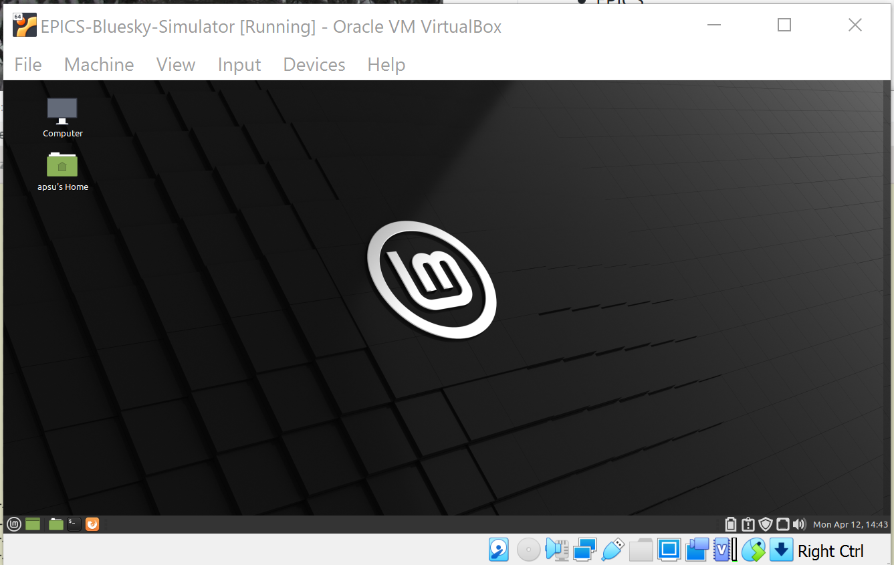

# Installing the VM

CONTENTS

- [Installing the VM](#installing-the-vm)
  - [Oracle VM VirtualBox Manager](#oracle-vm-virtualbox-manager)
  - [Download EPICS-Bluesky-Simulator VM image](#download-epics-bluesky-simulator-vm-image)
  - [Installation Parameters](#installation-parameters)
  - [Start the VM](#start-the-vm)

## Oracle VM VirtualBox Manager

You will need:

* *Oracle VM VirtualBox* software on your host computer: [https://www.virtualbox.org/](https://www.virtualbox.org/)
* [Download and install both parts](https://www.virtualbox.org/wiki/Downloads)
  1. *VirtualBox platform package* for your host computer OS
  2. *Oracle VM VirtualBox Extension Pack*
* 2 GB RAM reserved for the training VM to use
* 10 GB hard disk space for the downloaded VM image file (can delete the image once installed)
* 20-40 GB hard disk space for the VM image to use

It is helpful to give the VM image its own CPU core.

## Download EPICS-Bluesky-Simulator VM image

The VM is about 10GB in size.  Download from 
https://box.com/url/to/be/provided

In the *Oracle VM VirtualBox Manager* main window, choose *Import Appliance* from the *File* menu and select the downloaded file.

Once imported, the main window will show the *EPICS-Bluesky-Simulator* (and any
other VMs you may have already installed).

## Installation Parameters

term | value
:--- | :---
Name | EPICS-Bluesky-Simulator
Type | Linux
Version | Ubuntu (64-bit)
RAM | 2048 MB
CPU | 1
Graphics RAM | 16 MB (16MB is OK)
Hard disk type | VDI (VirtualBox Disk Image), dynamically allocated
Download URL | [Linux Mint](https://linuxmint.com/edition.php?id=285)
VDI Size | 30 GB
Release | Linux Mint 20.1 "Ulyssa" - MATE (64-bit)
Your name | APS-U EPICS beam line Bluesky Simulator
Computer's name | apsu-sim
user | `apsu`
password | (see the instructions below)
Login automatically | Yes

To get the password for the `apsu` account, 

* open the *Oracle VM VirtualBox Manager* main window (shown above)
* select the *EPICS-Bluesky-Simulator* in the left panel
* double-click the *Settings* gear
* On the *General* settings, open the *Description* tab

The account password will be described here (note: password is **not** shown in the image).

## Start the VM

From the *Oracle VM VirtualBox Manager* main window (shown above), select the
*EPICS-Bluesky-Simulator* in the left panel, then click the green *Start* arrow
icon to start the VM.  Once the VM starts, it should login automatically to the
`apsu` account:

Note the VM *Manager* is provides the menu bar with *File*, *Machine*, ... menus
and the bottom-most row of icons (ending with `Right Ctrl`).  These are **not**
part of the Linux VM.  Consult the VirtualBox documentation for details of these
controls

The Linux virtual machine is inside of the VM *Manager* controls.  The `LM` icon
(in the circle) at lower left is a pop-up menu to access a variety of software
installed in the VM.  To its right are icons for *show/hide the desktop*, *file
browser*, *terminal*, and *web browser*, respectively.

